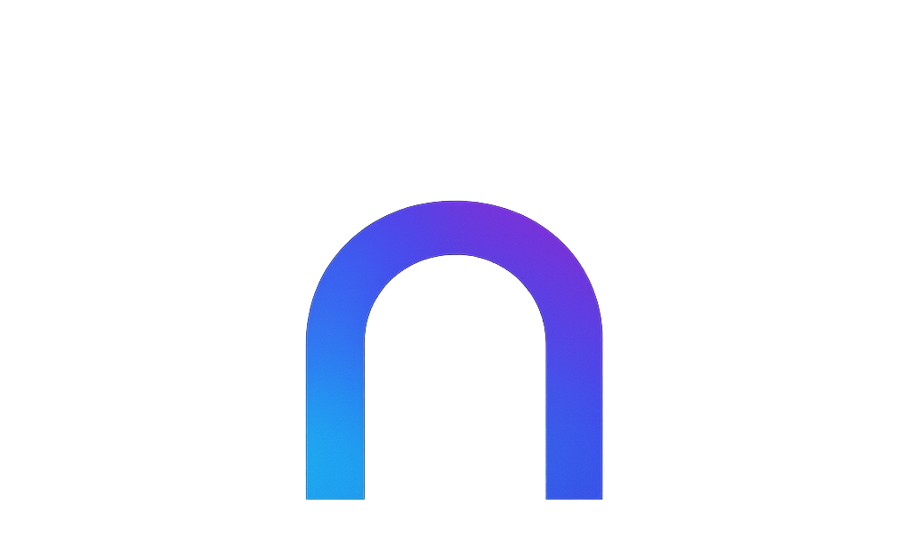

# 🎯 Productivity App

<div align="center">
  
  
  **Tu rutina. Tu mente. Tu orden.**
  
  Una aplicación moderna de productividad que te ayuda a organizar tu vida y alcanzar tus metas.
</div>

## ✨ Características

- 📝 **Gestión de Tareas** - Crea, organiza y completa tareas con sistema de prioridades
- 📅 **Calendario Inteligente** - Visualiza tus tareas en un calendario interactivo
- 📊 **Analytics de Productividad** - Analiza tu rendimiento con gráficos detallados
- 🎯 **Sistema de Metas** - Define y rastrea objetivos a largo plazo
- 🌙 **Modo Oscuro/Claro** - Interfaz adaptable a tus preferencias
- 🔐 **Autenticación Segura** - Sistema de login con Firebase Auth
- ☁️ **Sincronización en la Nube** - Tus datos seguros en Firebase

## 🚀 Tecnologías

- **Frontend**: React.js
- **Backend**: Firebase (Firestore, Auth)
- **Estilos**: CSS personalizado con variables
- **Fechas**: date-fns
- **Routing**: React Router

## 📦 Instalación

1. Clona el repositorio:
```bash
git clone <repository-url>
cd Arch
```

2. Instala las dependencias:
```bash
npm install
```

3. Configura Firebase:
   - Crea un proyecto en [Firebase Console](https://console.firebase.google.com)
   - Habilita Authentication y Firestore
   - Actualiza `src/firebase/firebaseConfig.js` con tu configuración

4. Inicia la aplicación:
```bash
npm start
```

## 🎨 Capturas de Pantalla

### Dashboard Principal
- Vista general con estadísticas de productividad
- Acceso rápido a todas las funcionalidades

### Gestión de Tareas
- Interfaz intuitiva para crear y organizar tareas
- Sistema de prioridades con códigos de color

### Calendario
- Vista mensual con tareas organizadas por día
- Navegación fluida entre meses

### Analytics
- Gráficos de productividad y tendencias
- Métricas de rendimiento personal

## 🔧 Configuración

La aplicación utiliza Firebase para el backend. Asegúrate de configurar:

- **Authentication**: Email/Password habilitado
- **Firestore**: Reglas de seguridad configuradas
- **Hosting**: Para despliegue en producción

## 📱 Uso

1. **Registro/Login**: Crea una cuenta o inicia sesión
2. **Dashboard**: Explora las estadísticas y navegación
3. **Tareas**: Agrega y gestiona tus tareas diarias
4. **Calendario**: Planifica y visualiza tu agenda
5. **Metas**: Define objetivos y rastrea tu progreso

---

- **Desarrollado con**: ❤️ y mucho ☕

---

<div align="center">
  <strong>¡Transforma tu productividad hoy mismo!</strong>
</div>
